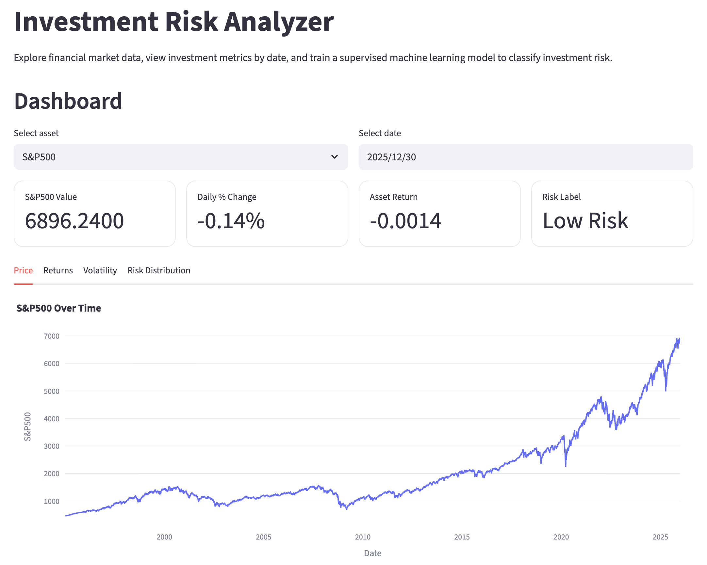
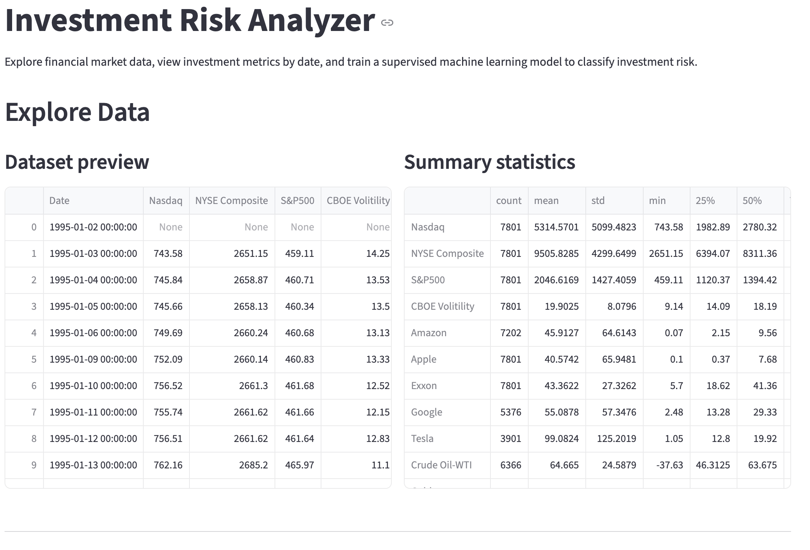
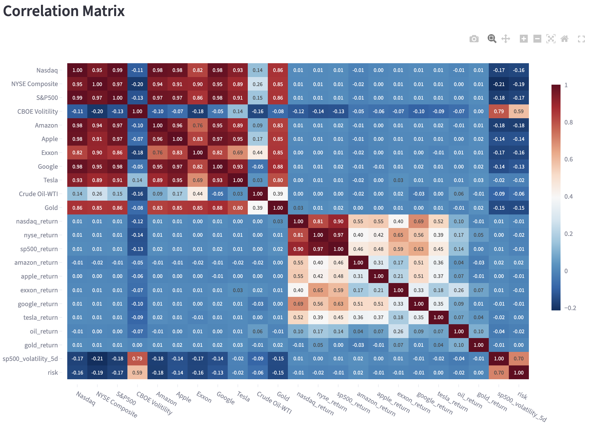
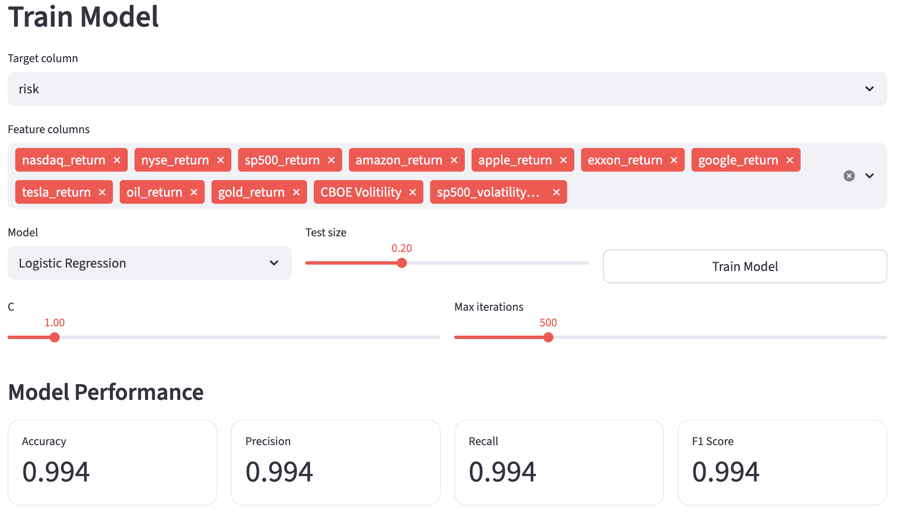
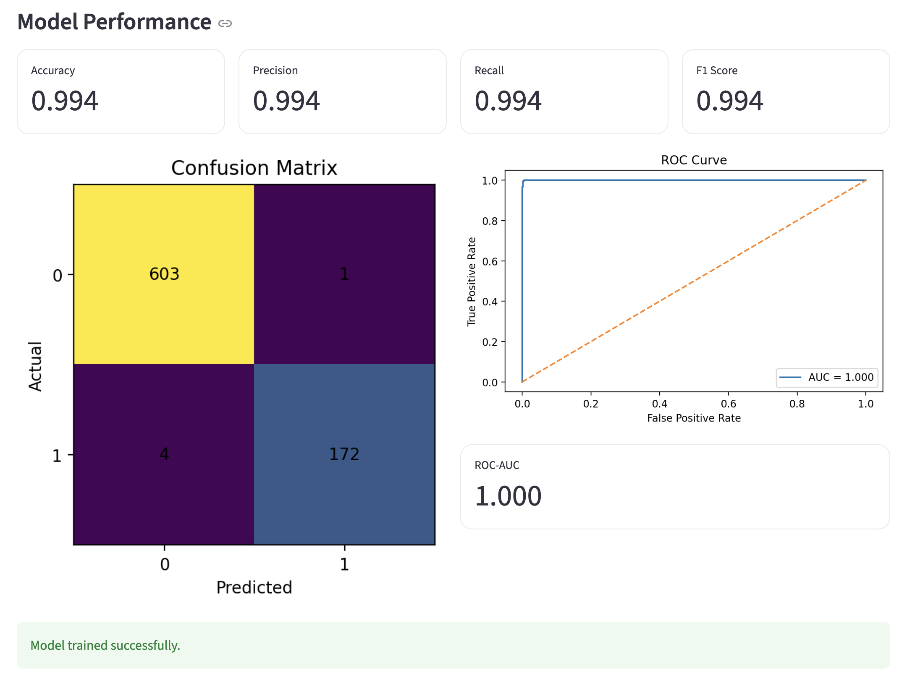
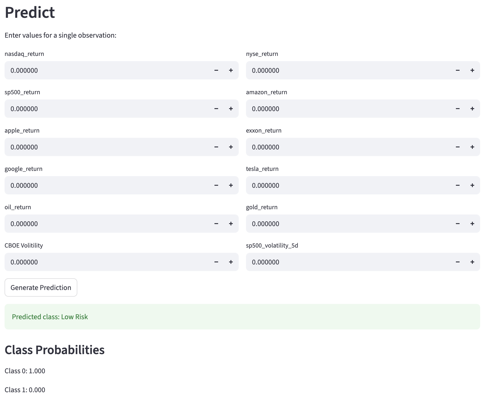

# Investment Risk Analyzer - Machine Learning Streamlit App

## Project Overview

**Investment Risk Analyzer** is an advanced interactive machine learning web application built with Streamlit that enables users to analyze 30 years of financial market data and predict investment risk levels. The app provides a complete data science workflow: from exploratory data analysis and correlation analysis to model training with hyperparameter tuning and real-time risk predictions.

Users can upload custom datasets or use the provided 30-year historical market dataset, select from three supervised machine learning models (Logistic Regression, Decision Tree, K-Nearest Neighbors), experiment with hyperparameters, evaluate model performance with advanced metrics, and generate predictions with class probabilities.

This project demonstrates production-ready machine learning development, from data preprocessing to cloud deployment, with an intuitive interface that invites exploration and communicates results clearly.

---

## Features

### Dashboard
- **Interactive Asset Selection**: Choose from 11+ financial assets including major indices (Nasdaq, NYSE, S&P 500), tech stocks (Amazon, Apple, Google, Tesla), commodities (Gold, Crude Oil-WTI), and volatility measures (CBOE Volatility)
- **Dynamic Date Selection**: Pick any date from the dataset to view point-in-time metrics
- **Real-Time Metrics**: Display current asset value, daily % change, asset return, and risk label
- **Four Analytical Tabs**:
  - **Price Tab**: Historical price trends over 30 years with interactive Plotly charts
  - **Returns Tab**: Daily returns visualization showing percentage changes
  - **Volatility Tab**: 5-day rolling volatility of S&P 500 returns
  - **Risk Distribution Tab**: Bar chart showing balance of High Risk vs Low Risk observations
- **Date-Aware Metrics**: Automatic calculation of daily changes and returns based on selected date

### Explore Data
- **Dataset Preview**: View raw data with scrollable table of first 20 rows
- **Summary Statistics**: Statistical breakdown (count, mean, std, min, 25%, 50%, 75%, max) of all numeric columns
- **Interactive Time-Series**: Select any numeric column to visualize trends over time
- **Correlation Matrix**: Full heatmap showing relationships between all features with color-coded values (red = positive, blue = negative)
- **Automatic Feature Detection**: Dynamically identifies all numeric columns in your dataset

### Train Model
- **Three Supervised Learning Models**:
  - **Logistic Regression**: Binary classification with regularization (C parameter)
  - **Decision Tree**: Interpretable tree-based model with depth and split controls
  - **K-Nearest Neighbors**: Instance-based learning with configurable neighbors
- **Flexible Feature Selection**: Multi-select interface to choose features for training
- **Hyperparameter Tuning**:
  - Logistic Regression: C (0.01-10.0), max iterations (100-2000)
  - Decision Tree: max depth (1-20), min samples split (2-20)
  - K-Nearest Neighbors: number of neighbors (1-25)
- **Adjustable Train-Test Split**: Test size slider (0.10-0.40, default 0.20)
- **Comprehensive Performance Metrics**:
  - Accuracy, Precision, Recall, F1 Score (weighted average)
  - Confusion Matrix with visual heatmap
  - ROC Curve with AUC score (for binary classification)
- **Stratified Sampling**: Ensures balanced class distribution in train/test splits
- **Success Feedback**: Green confirmation message when model trains successfully

### Predict
- **Custom Input Interface**: Two-column form layout for entering feature values
- **Number Input Fields**: Precise decimal input with +/- increment buttons
- **Binary Risk Classification**: Instant prediction as "High Risk" or "Low Risk"
- **Class Probabilities**: Display probability scores for each class (e.g., Class 0: 0.98, Class 1: 0.02)
- **Session Persistence**: Trained models remain available throughout user session
- **Color-Coded Results**: Red alert for High Risk, green success for Low Risk

---

## Technical Stack

| Component | Technology | Purpose |
|-----------|-----------|---------|
| **Web Framework** | Streamlit | Interactive UI and app development |
| **Data Processing** | Pandas, NumPy | Data manipulation and calculations |
| **Machine Learning** | scikit-learn | Models, preprocessing, metrics |
| **Visualization** | Plotly, Matplotlib | Interactive charts and static plots |
| **Navigation** | streamlit-option-menu | Customizable sidebar menu with icons |
| **Input Data** | CSV/Excel files | User-friendly data upload |

---

## Installation & Setup

### Local Deployment

1. **Clone the Repository**
   ```bash
   git clone https://github.com/passionhood/Hood-Data-Science-Portfolio.git
   cd Hood-Data-Science-Portfolio/MLStreamlitApp
   ```

2. **Create Virtual Environment** (Recommended)
   ```bash
   python -m venv venv
   source venv/bin/activate  # On Windows: venv\Scripts\activate
   ```

3. **Install Dependencies**
   ```bash
   pip install -r requirements.txt
   ```

4. **Run the App Locally**
   ```bash
   streamlit run main.py
   ```
   The app will open automatically in your browser at `http://localhost:8501`

### Required Libraries & Versions
```
streamlit>=1.28.0
pandas>=1.5.0
numpy>=1.24.0
scikit-learn>=1.3.0
plotly>=5.17.0
matplotlib>=3.7.0
streamlit-option-menu>=0.3.6
openpyxl>=3.10.0
```

---

## Live Deployment

 **Access the deployed app**: [Investment Risk Analyzer on Streamlit Cloud](https://hood-data-science-portfolio-5snejofrhraukzd95hbjb6.streamlit.app/)

The app is published to Streamlit Community Cloud and is fully functional without any local setup required.

---

## How to Use the App

### Step 1: Load Your Data
1. In the sidebar, choose one of two options:
   - **Use Sample Dataset**: Check "Use sample dataset" to load 30 years of market data
   - **Upload Custom Data**: Click "Upload a CSV or Excel file" to add your own financial data
2. Download the sample dataset template if needed for reference
3. Dataset must include a "Date" column for proper functionality

### Step 2: Explore the Dashboard
1. Navigate to **Dashboard** in the sidebar menu
2. **Select an asset** from the dropdown (S&P 500, Nasdaq, individual stocks, etc.)
3. **Pick a date** using the date picker to see point-in-time metrics
4. View four analytics tabs:
   - **Price**: Historical price trend for your selected asset
   - **Returns**: Daily percentage returns over time
   - **Volatility**: 5-day rolling volatility of S&P 500
   - **Risk Distribution**: Count of High Risk vs Low Risk observations

### Step 3: Explore Your Data
1. Go to **Explore Data** to understand your dataset
2. Review **Dataset preview** (first 20 rows) on the left
3. Check **Summary statistics** on the right (mean, std, percentiles)
4. Select a numeric column in the dropdown to see its **time-series chart**
5. Scroll down to view the **Correlation Matrix** showing relationships between all features

### Step 4: Train a Machine Learning Model
1. Navigate to **Train Model**
2. **Select Target Column**: Usually "risk" for binary classification
3. **Choose Features**: Multi-select the features you want to use for predictions
   - Pre-populated with common features: returns, volatility, individual asset returns
   - Remove or add features as needed
4. **Pick Your Model**:
   - **Logistic Regression**: Fast, interpretable, good for linear relationships
   - **Decision Tree**: Easy to understand, no scaling needed
   - **K-Nearest Neighbors**: Non-parametric, captures local patterns
5. **Tune Hyperparameters**:
   - Adjust sliders to customize model behavior
   - Experiment to see how parameters affect performance
6. **Set Test Size**: Decide train/test split (e.g., 0.20 = 80% train, 20% test)
7. **Click "Train Model"** and wait for results
8. Review **Model Performance**:
   - Four metrics cards (Accuracy, Precision, Recall, F1)
   - **Confusion Matrix**: Shows True Positives, False Positives, etc.
   - **ROC Curve**: Visualizes classifier trade-off (binary classification only)

### Step 5: Make Risk Predictions
1. Go to **Predict** page (only available after training a model)
2. **Enter Feature Values**: Two-column form with input fields for each selected feature
   - Use +/- buttons to adjust values precisely
   - All fields default to 0.000000
3. **Click "Generate Prediction"**
4. View **Predicted Risk Class**: High Risk (red) or Low Risk (green)
5. Check **Class Probabilities**: Confidence scores for each class

---

## Visual Examples

###  Dashboard Overview

*The Dashboard tab displays key metrics for your selected asset on a chosen date, including current value, daily % change, asset return, and risk label. Below are interactive time-series charts showing 30 years of price history.*

###  Explore Data Tab

*Left side shows raw data preview; right side displays summary statistics. Users can select any numeric column to visualize trends over time with interactive charts.*

###  Correlation Matrix

*Complete correlation matrix heatmap showing relationships between all 20+ features including prices, returns, volatility measures, and the risk target variable. Red indicates positive correlation, blue indicates negative.*

###  Train Model Interface

*Feature selection (11 features pre-selected), model selection (Logistic Regression shown), hyperparameter sliders for C and max iterations, test size slider (0.20), and Train Model button ready to execute.*

###  Model Performance Results

*Four metric cards showing Accuracy (0.994), Precision (0.994), Recall (0.994), F1 Score (0.994). Left: Confusion matrix with 603 True Negatives, 172 True Positives, minimal errors. Right: ROC curve with perfect AUC = 1.000.*

###  Prediction Interface

*Two-column input form with 11 number inputs for feature values. After clicking "Generate Prediction", displays predicted class (Low Risk with green banner) and class probabilities (Class 0: 1.000, Class 1: 0.000).*

---

## Feature Engineering

The app automatically creates machine learning-ready features during data loading:

| Feature | Calculation | Purpose | Type |
|---------|-----------|---------|------|
| **nasdaq_return** | `Nasdaq.pct_change()` | Daily % change in Nasdaq | Input Feature |
| **nyse_return** | `NYSE Composite.pct_change()` | Daily % change in NYSE | Input Feature |
| **sp500_return** | `S&P500.pct_change()` | Daily % change in S&P 500 | Input Feature |
| **amazon_return** | `Amazon.pct_change()` | Daily % change in Amazon stock | Input Feature |
| **apple_return** | `Apple.pct_change()` | Daily % change in Apple stock | Input Feature |
| **exxon_return** | `Exxon.pct_change()` | Daily % change in Exxon stock | Input Feature |
| **google_return** | `Google.pct_change()` | Daily % change in Google stock | Input Feature |
| **tesla_return** | `Tesla.pct_change()` | Daily % change in Tesla stock | Input Feature |
| **oil_return** | `Crude Oil-WTI.pct_change()` | Daily % change in crude oil | Input Feature |
| **gold_return** | `Gold.pct_change()` | Daily % change in gold price | Input Feature |
| **sp500_volatility_5d** | `sp500_return.rolling(5).std()` | 5-day rolling std dev of S&P returns | Input Feature |
| **risk** (Target) | Binary: 1 if volatility > 70th percentile, else 0 | Classification label | **Target Variable** |

### How Risk Label Works
- Calculated daily based on the 70th percentile of rolling volatility
- High Risk (1): Days when volatility exceeds the 70th percentile threshold
- Low Risk (0): Days when volatility is at or below the threshold
- Ensures balanced classes with approximately 30% High Risk, 70% Low Risk

---

## Model Architecture

### Preprocessing Pipelines

**Logistic Regression Pipeline**:
```
Raw Data → SimpleImputer (median) → StandardScaler → LogisticRegression
```
- Handles missing values with median imputation
- Scales features (required for regression algorithms)
- Configurable C (regularization) and max_iter parameters

**Decision Tree Pipeline**:
```
Raw Data → SimpleImputer (median) → DecisionTreeClassifier
```
- Handles missing values with median imputation
- No scaling needed (tree-based models are scale-invariant)
- Configurable max_depth and min_samples_split

**K-Nearest Neighbors Pipeline**:
```
Raw Data → SimpleImputer (median) → StandardScaler → KNeighborsClassifier
```
- Handles missing values with median imputation
- Scales features (required for distance-based models)
- Configurable n_neighbors parameter

### Train-Test Split Strategy
- **Stratified Split**: Maintains class balance in both train and test sets
- **Random State**: 42 (reproducible results across runs)
- **Default Test Size**: 20% test, 80% training (adjustable via slider 0.10-0.40)
- **Handling Missing Values**: Automatically imputed before modeling

### Model Evaluation Metrics
- **Multi-class Support**: Weighted averages used for multi-class metrics
- **Binary Classification**: ROC-AUC metric displayed only for 2-class problems
- **Confusion Matrix**: Complete prediction outcome visualization
- **All Metrics**: Accuracy, Precision, Recall, F1 Score

---

## File Structure

```
MLStreamlitApp/
├── main.py                                      # Main Streamlit application (500+ lines)
├── 30_yr_market_data_with_formulas.xlsx        # Sample dataset (30 years of market data)
├── README.md                                    # This documentation file
└── screenshots/                                 # Visual examples for README
    ├── 01_dashboard_overview.png
    ├── 02_explore_data_tab.png
    ├── 03_correlation_matrix.png
    ├── 04_train_model_interface.png
    ├── 05_model_performance.png
    └── 06_prediction_interface.png
```

---

## Code Organization

The `main.py` (500+ lines) is organized into logical sections:

1. **Imports & Configuration** (Lines 1-80): Libraries, page config, styling
2. **Constants & Mappings** (Lines 82-105): Asset lists, return mappings
3. **Helper Functions** (Lines 107-240): Data loading, cleaning, feature engineering, visualization
4. **Sidebar Navigation** (Lines 242-275): Page routing, file upload
5. **Data Loading** (Lines 277-289): Priority logic for sample vs uploaded data
6. **Page Implementation** (Lines 291+): Dashboard, Explore Data, Train Model, Predict

---

## References & Resources

### Official Documentation
- [Streamlit Docs](https://docs.streamlit.io/) - Framework documentation
- [scikit-learn User Guide](https://scikit-learn.org/stable/user_guide.html) - ML models
- [Pandas Documentation](https://pandas.pydata.org/docs/) - Data manipulation
- [Plotly Python](https://plotly.com/python/) - Interactive visualizations
- [NumPy Documentation](https://numpy.org/doc/) - Numerical computing

### Tutorials & Learning Resources
- [Streamlit Getting Started](https://docs.streamlit.io/library/get-started) - Framework basics
- [ML Pipelines with scikit-learn](https://scikit-learn.org/stable/modules/compose.html) - Pipeline design
- [Hyperparameter Tuning](https://towardsdatascience.com/hyperparameter-tuning-c5619e7b6c75) - Best practices
- [Logistic Regression](https://scikit-learn.org/stable/modules/linear_model.html#logistic-regression) - Theory & implementation
- [Decision Trees](https://scikit-learn.org/stable/modules/tree.html) - Tree-based models
- [ROC-AUC Explained](https://developers.google.com/machine-learning/crash-course/classification/roc-and-auc) - Model evaluation
- [K-Nearest Neighbors](https://scikit-learn.org/stable/modules/neighbors.html) - Distance-based models

---

## Future Enhancements

Potential features for v2.0:
- [ ] Additional models: Random Forest, SVM, Gradient Boosting, Neural Networks
- [ ] Cross-validation for robust evaluation (k-fold, stratified)
- [ ] Feature importance visualization (tree and linear models)
- [ ] Advanced data preprocessing UI (outlier removal, encoding options)
- [ ] Model comparison dashboard (side-by-side metrics)
- [ ] Export trained models (pickle/joblib files)
- [ ] Interactive hyperparameter grid search
- [ ] Feature selection algorithms (recursive elimination, SelectKBest)
- [ ] Real-time data streaming integration
- [ ] Model explainability (SHAP values, LIME)

---

## Troubleshooting

| Issue | Solution |
|-------|----------|
| **"Please upload a dataset or use the sample dataset"** | Check "Use sample dataset" box OR upload a CSV/Excel file in the uploader |
| **"Your dataset must include a Date column"** | Ensure your data has a column named "Date" (case-insensitive) with format YYYY-MM-DD or MM/DD/YYYY |
| **Model won't train / "Please select at least one feature"** | Use the multi-select to choose at least one feature before clicking Train Model |
| **"Train a model first" on Predict page** | Go to Train Model tab, select features, pick a model, and click "Train Model" button |
| **Poor model accuracy** | Try different features, adjust hyperparameters, check data quality, or use different model types |
| **App runs slowly or freezes** | Dataset may be too large; use sample data or clear cache with `streamlit cache clear` |
| **Import errors (ModuleNotFoundError)** | Reinstall dependencies: `pip install -r requirements.txt --upgrade` |
| **Date parsing errors** | Ensure Date column uses standard datetime formats (YYYY-MM-DD, MM/DD/YYYY) |

---

## Key Learnings & Skills Demonstrated

**Machine Learning**:
-  Complete ML workflow: loading → cleaning → feature engineering → training → evaluation
-  Three model types: Logistic Regression, Decision Tree, K-Nearest Neighbors
-  Hyperparameter tuning with real-time performance feedback
-  Model evaluation: accuracy, precision, recall, F1, ROC-AUC, confusion matrices
-  Binary classification with probability outputs
-  Stratified sampling for balanced splits
-  Preprocessing pipelines: imputation, scaling, integration

**Data Science**:
-  Exploratory data analysis with visualizations
-  Feature engineering: returns, rolling volatility, risk labels
-  Correlation analysis and feature relationships
-  Time-series data handling (30-year financial dataset)
-  Statistical summaries and distributions

**Software Engineering**:
-  Interactive web development with Streamlit
-  Modular, documented code architecture
-  Reusable helper functions
-  Error handling and user-friendly messages
-  Session state management
-  Production-ready code quality

**UI/UX Design**:
-  Multi-page navigation with intuitive menus
-  Interactive controls: sliders, dropdowns, date pickers
-  Real-time feedback with color-coded results
-  Responsive layouts with columns and tabs
-  Professional styling with custom CSS
-  Clear instructions and informative messages
