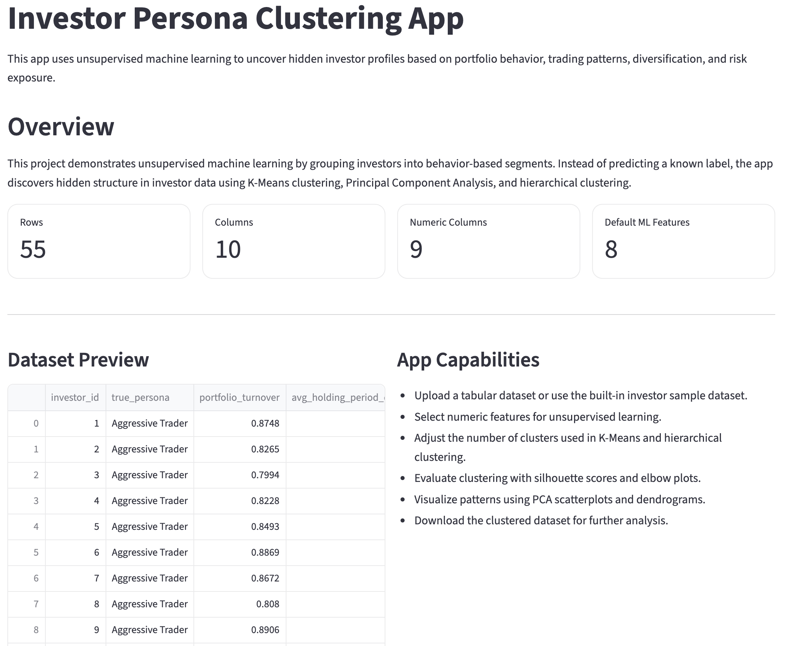
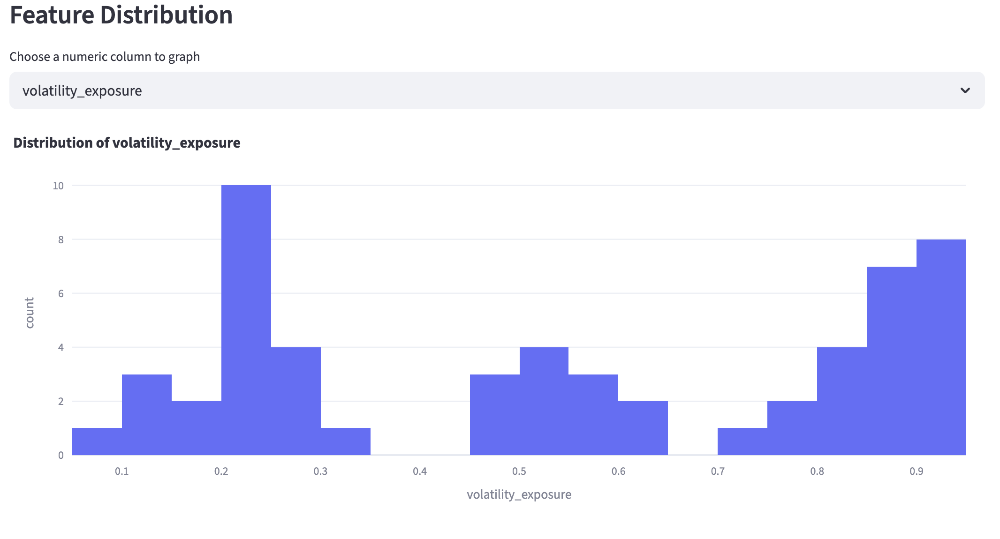
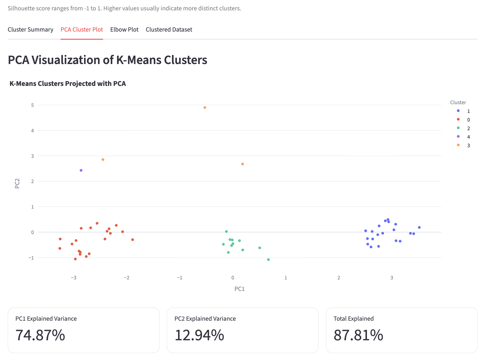
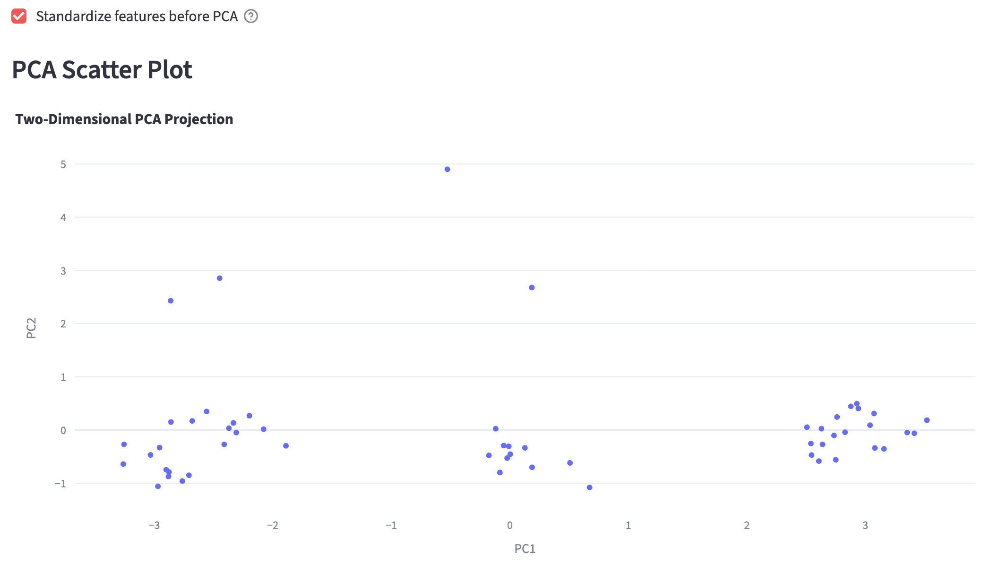
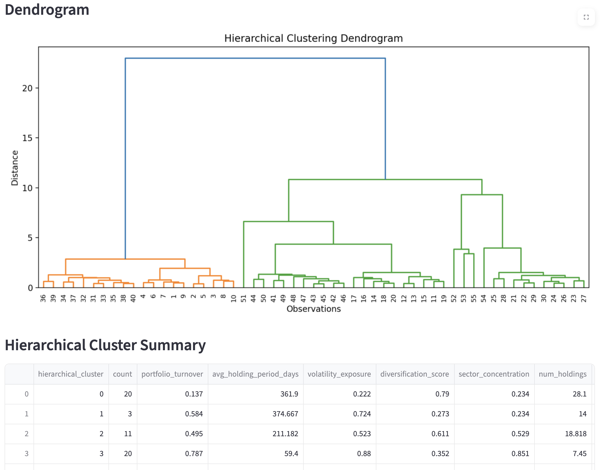

# Investor Persona Clustering App – Unsupervised Machine Learning

## Project Overview

**Investor Persona Clustering App** is an interactive unsupervised machine learning web application built with Streamlit that uncovers hidden investor behavior profiles based on portfolio characteristics and trading patterns.

Unlike traditional supervised models that predict predefined labels, this app focuses on discovering structure within the data. By applying clustering techniques such as K-Means and hierarchical clustering, along with dimensionality reduction through Principal Component Analysis (PCA), the app identifies distinct investor personas without prior labeling.

Users can upload their own dataset or explore a built-in simulated investor dataset, adjust model parameters, and visually interpret how investors group based on behavior, diversification, and risk exposure.

---

## App Preview

### Overview Dashboard


This view provides a high-level summary of the dataset, including the number of rows, columns, and numeric features. It also displays a preview of the data and outlines the app’s capabilities, giving users an immediate understanding of the dataset structure and available analysis tools.

---

### Data Exploration


The data exploration page allows users to analyze distributions of individual features and examine relationships between variables through a correlation matrix. This step is critical for understanding patterns before applying clustering models.

---

### K-Means Clustering Results


This section shows the results of K-Means clustering, including cluster summaries, silhouette score, and feature averages for each group. It also provides plain-English interpretations of clusters, helping translate model output into meaningful investor personas.

---

### PCA Visualization


Principal Component Analysis (PCA) reduces the dataset into two dimensions, allowing clusters to be visualized in a 2D space. Points that are closer together represent investors with more similar portfolio behavior.

---

### Hierarchical Clustering (Dendrogram)


The dendrogram visualizes how investors are grouped step-by-step in hierarchical clustering. It reveals the relationships between clusters and helps users understand how different investor profiles merge at different similarity levels.

---

## Key Features

### Dataset Flexibility
- Upload custom tabular datasets (CSV or Excel)
- Use a built-in investor behavior dataset with realistic variation and noise
- Download sample dataset for experimentation

### Explore Data
- Dataset preview and summary statistics
- Feature distribution visualization
- Correlation matrix heatmap
- Automatic detection of numeric features

### K-Means Clustering
- Adjustable number of clusters (k)
- Feature selection for clustering
- Optional feature standardization
- Model evaluation with:
  - Silhouette score
  - Elbow plot
- Cluster summary tables (mean feature values)
- Plain-English cluster interpretations (investor personas)

### PCA (Principal Component Analysis)
- Dimensionality reduction to 2 components
- Interactive 2D scatterplot visualization
- Explained variance metrics
- Feature loadings for interpretability

### Hierarchical Clustering
- Agglomerative clustering (Ward linkage)
- Adjustable number of clusters
- Dendrogram visualization
- PCA-based cluster visualization
- Cluster summary and comparison

### Export Functionality
- Download clustered datasets (K-Means and hierarchical)
- Enables further analysis outside the app

---

## Technical Stack

| Component | Technology | Purpose |
|----------|------------|--------|
| Web Framework | Streamlit | Interactive UI |
| Data Processing | Pandas, NumPy | Data manipulation |
| Machine Learning | scikit-learn | Clustering & PCA |
| Visualization | Plotly, Matplotlib | Charts |
| Clustering Tools | SciPy | Hierarchical clustering |
| Navigation | streamlit-option-menu | Sidebar UI |

---

## Installation & Setup

### Run Locally

```bash
git clone https://github.com/passionhood/Hood-Data-Science-Portfolio.git
cd Hood-Data-Science-Portfolio/MLUnsupervisedApp
pip install -r requirements.txt
streamlit run main.py