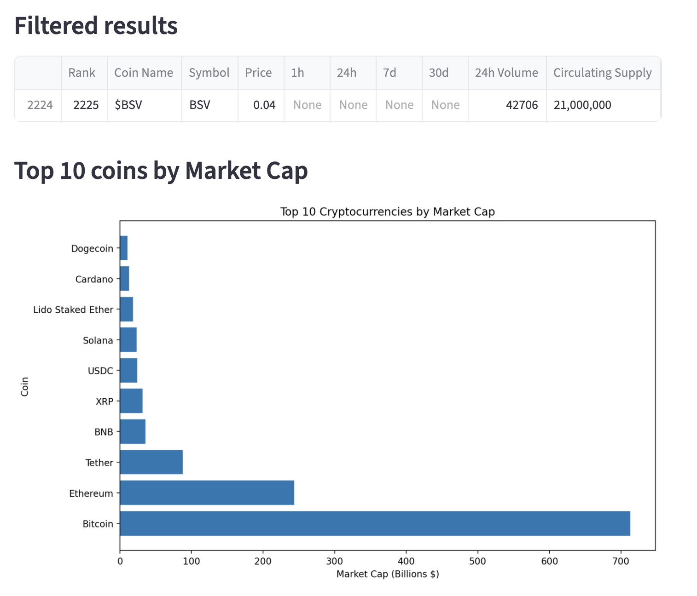

# Cryptocurrency Dashboard

## App Description
This Streamlit app allows users to explore a comprehensive cryptocurrency dataset by selecting a specific coin and filtering results based on market capitalization. The app loads data from a CSV file, displays sample data, and provides interactive visualizations to analyze cryptocurrency trends and market metrics.

## Dataset Features

The cryptocurrency dataset contains **200+ cryptocurrencies** with the following features:

| Feature | Description |
|---------|-------------|
| **Rank** | Market rank of the cryptocurrency |
| **Coin Name** | Full name of the cryptocurrency |
| **Symbol** | Ticker symbol (e.g., BTC, ETH) |
| **Price** | Current price in USD |
| **1h / 24h / 7d / 30d** | Price change percentages over different time periods |
| **24h Volume** | Trading volume over the last 24 hours |
| **Circulating Supply** | Number of coins currently in circulation |
| **Total Supply** | Maximum supply of the coin |
| **Market Cap** | Total market capitalization in USD |

### Example Visualizations

**Top 10 Cryptocurrencies by Market Cap:**


This visualization shows the dominance of Bitcoin and Ethereum in the cryptocurrency market, with Bitcoin commanding approximately $712 billion in market capitalization.

## How to Run the App

1. Ensure you have the required dependencies installed:
```bash
pip install -r requirements.txt
```

2. Clone this repository or download the app to your local machine.

3. Navigate to the folder containing the app:
```bash
cd basic_streamlit_app
```

4. Run the app using Streamlit:
```bash
streamlit run main.py
```

5. The app will open in your default web browser. You can now:
   - Select a cryptocurrency from the dropdown menu
   - Use the Market Cap range slider to filter results
   - View filtered data and market cap visualizations

## Features

- **Coin Selection**: Browse and select from 200+ cryptocurrencies
- **Market Cap Filtering**: Filter coins by market capitalization range
- **Interactive Data Table**: View detailed cryptocurrency metrics
- **Market Cap Visualization**: Bar chart showing the top 10 cryptocurrencies
- **Data Preprocessing**: Automatic handling of currency formatting and missing values